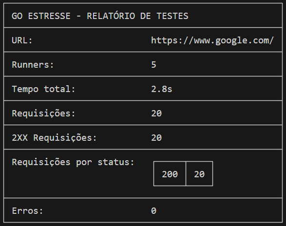

# GO-STRESSTEST

Sistema para realizar testes de estresse em requisições por URL.

### Como usar:

- Execute o comando: `docker buld -t go-stresstest .`
- Rode o sistema com o comando docker: 

```docker
docker run --rm go-stresstest --url=https://www.google.com/ --requests=20 --concurrency=5
```

**Possíveis parâmetros:**

|Valor|Valor Curto|Descrição|
|---|---|---|
|url|u|URL que será testada.|
|requests|r|Total de requisições que serão realizadas.|
|concurrency|c|Numéro de threads que serão feitas simultâneas.|


### Resultado esperado:

